### Lidar 3D Object Detetction Project

This is a summary of the implementation of the results of Lidar 3D object detection project

### Summary for Project Step One. it is divided into two section. Below is the result for each section

## Section One. Visualize range image channels (ID_S1_EX1)

I followed the instructions below:

In file loop_over_dataset.py, set the attributes for code execution in the following way:

- 1- data_filename = 'training_segment-1005081002024129653_5313_150_5333_150_with_camera_labels.tfrecord
- 2- show_only_frames = [0, 1]
- 3- exec_detection = []
- 4- exec_visualization = ['show_range_image']


I implemented the show_range_image function located in the file student/objdet_pcl.py.

- Convert range image “range” channel to 8bit 
- Convert range image “intensity” channel to 8bit 
- Crop range image to +/- 90 deg. left and right of the forward-facing x-axis
- Stack cropped range and intensity image vertically and visualize the result using OpenCV

Implmented these requirements based on the steps in the function 'show_range_image'

- Step 1 Line 76
- Step 2 Line 84
- Step 3 Line 89
- Step 4 Line 94
- Step 5 Line 104
- Step 6 Line 114

The outcome is a visualization of the range image


## Section Two. Visualize Point Cloud ((ID_S1_EX2)

Task preparations
In file loop_over_dataset.py, set the attributes for code execution in the following way:

- data_filename = 'training_segment-10963653239323173269_1924_000_1944_000_with_camera_labels.tfrecord'
- show_only_frames = [0, 200]
- exec_detection = []
- exec_tracking = []
- exec_visualization = ['show_pcl']

I implemented the show_pcl function located in the file student/objdet_pcl.py

- Step 1 Line 46
- Step 2 Line 52
- Step 3 Line 56
- Step 4 Line 59 


The outcome is a visualization of 10 cloud poits images shown below:

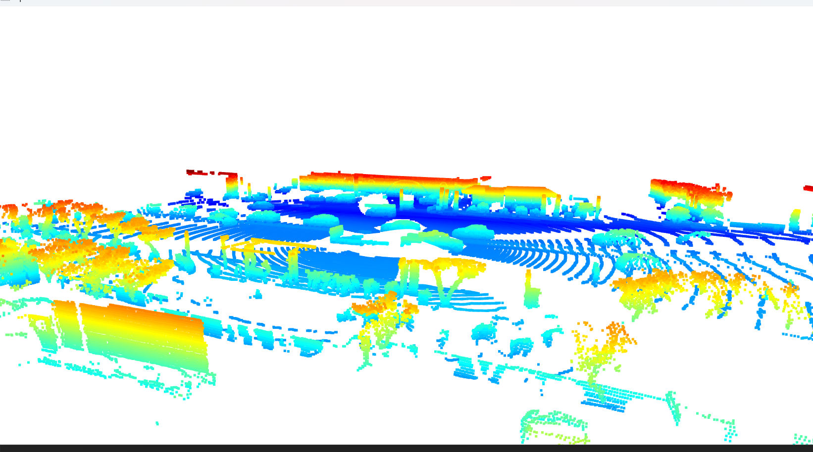
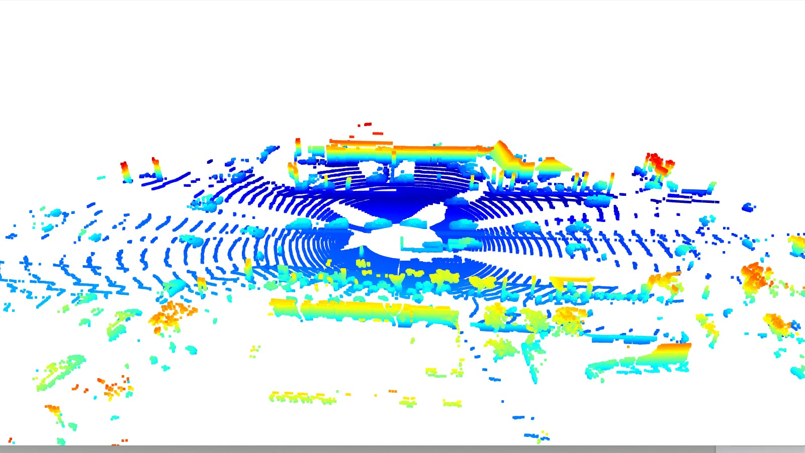f
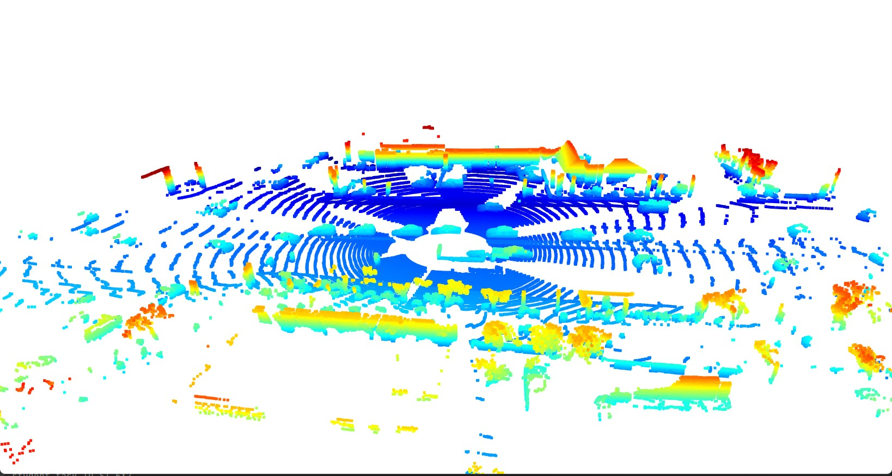
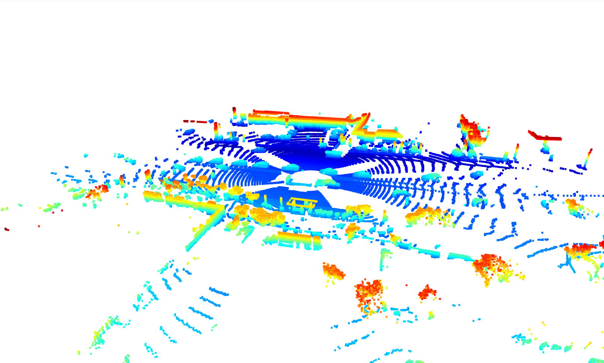
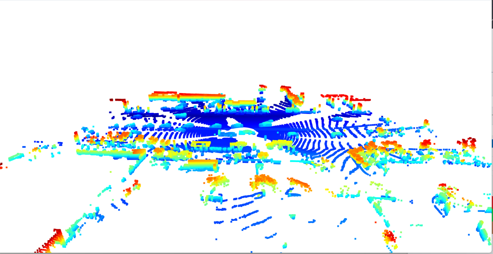
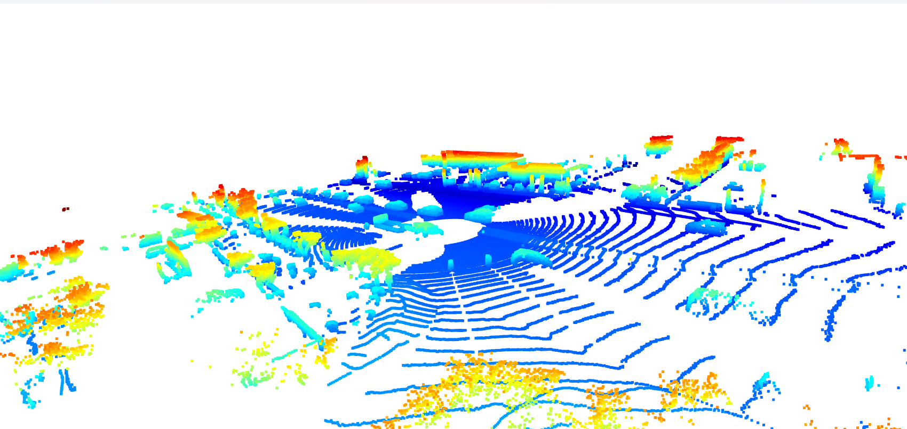
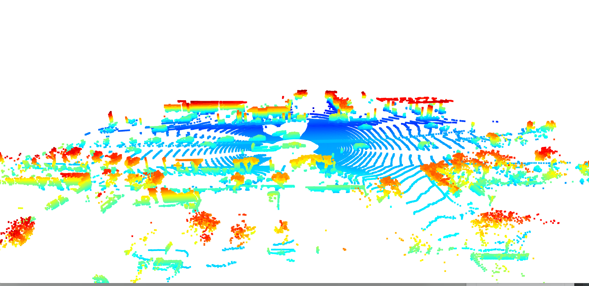
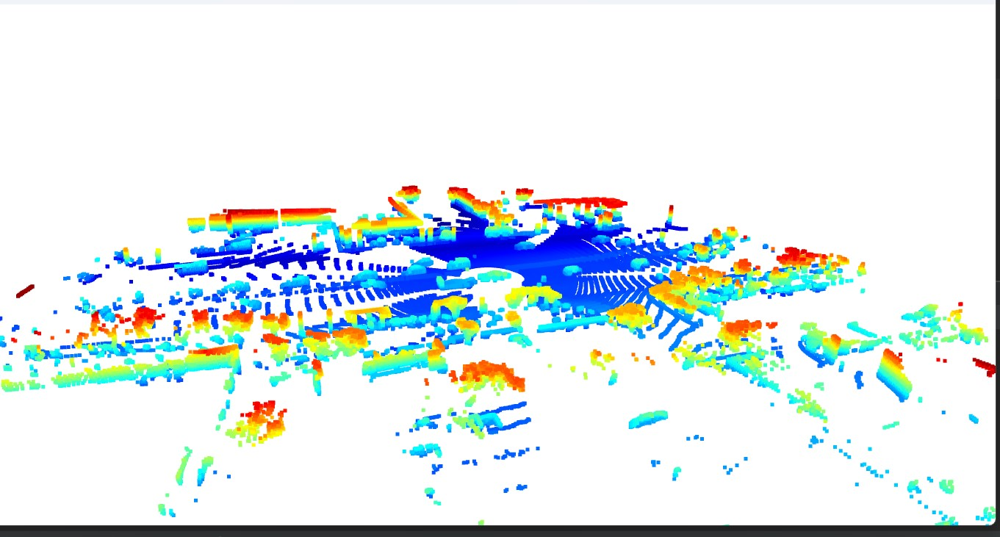
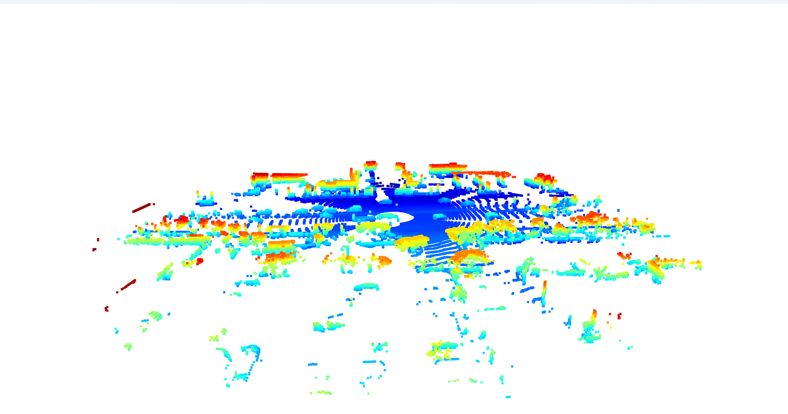
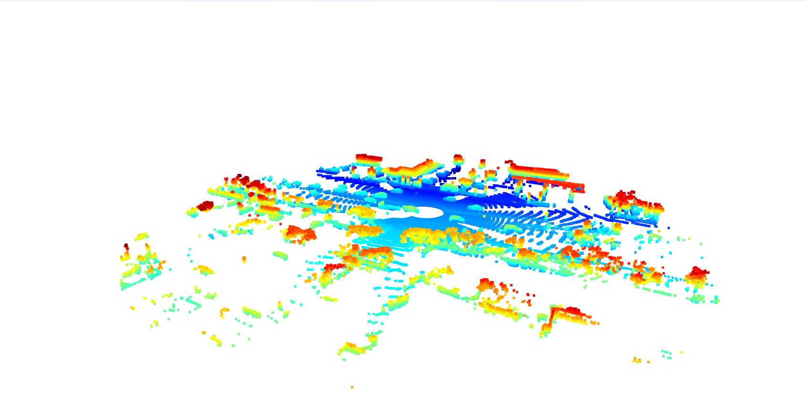


### Summary for Project Step Two. it is divided into three section. 

Task preparations

In file loop_over_dataset.py, set the attributes for code execution in the following way:

- data_filename = 'training_segment-1005081002024129653_5313_150_5333_150_with_camera_labels.tfrecord
- show_only_frames = [0, 1]
- exec_detection = ['bev_from_pcl']
- exec_tracking = []
- exec_visualization = []

The outcome of this task involves writing code within the function 'bev_from_pcl' located in the file student/objdet_pcl.py.

## Section one. Create BEV map

Convert coordinates in x,y [m] into x,y [pixel] based on width and height of the bev map


Convert sensor coordinates to BEV-map coordinates (ID_S2_EX1)

- Step 1 - Line 149
- Step 2 - Line 152
- Step 3 - Line 157
- Step 4 - Line 164


The outcome is a visualization of the intensity image


## Section two. Compute intensity layer of the BEV map (ID_S2_EX2)

- Assign lidar intensity values to the cells of the bird-eye view map
- Adjust the intensity in such a way that objects of interest (e.g. vehicles) are clearly visible

Compute intensity layer of the BEV map (ID_S2_EX2) function 'bev_from_pcl':

- Step 1 - Line 182
- Step 2 - Line 184
- Step 3 - Line 198
- Step 4 - Line 195
- Step 5 - Line 201


The outcome is a visualization of the intensity image


## Section three. Compute height layer of the BEV map (ID_S2_EX3)

- Make use of the sorted and pruned point-cloud lidar_pcl_top from the previous task
- Normalize the height in each BEV map pixel by the difference between max. and min. height
- Fill the "height" channel of the BEV map with data from the point-cloud

Compute height layer of the BEV map (ID_S2_EX3) in function 'bev_from_pcl':

- Step 1 - Line 218
- Step 2 - Line 220
- Step 3 - Line 227

The outcome is a visualization of the height image


### Summary for Project Step Three. it is divided into two section. 

Task preparations:

In file loop_over_dataset.py, set the attributes for code execution in the following way:

- data_filename = 'training_segment-1005081002024129653_5313_150_5333_150_with_camera_labels.tfrecord
- show_only_frames = [50, 51]
- exec_detection = ['bev_from_pcl', 'detect_objects']
- exec_tracking = []
- exec_visualization = ['show_objects_in_bev_labels_in_camera']
- configs_det = det.load_configs(model_name="fpn_resnet")

## Section One. Add a second model from a GitHub repo (ID_S3_EX1)

In addition to Complex YOLO, extract the code for output decoding and post-processing from the GitHub repo.

Modify Code in object_detect.py within three functions:

Funtion One: 'load_configs_model'. Add configuration paramters

- Step 1: Line 61 - 103

Function Two: 'Create_model'. Instantiate a model

- Step 1: Line 157 - 165

Function Three: 'detect_objects'. Perform inference

- Step 1: Line 206 - 222

The outcome is the output of this poece of code:
- outputs['hm_cen'] = _sigmoid(outputs['hm_cen'])
- outputs['cen_offset'] = _sigmoid(outputs['cen_offset'])
- detections = decode(outputs['hm_cen'], outputs['cen_offset'], outputs['direction'], outputs['z_coor'],outputs['dim'], K=configs.K)
- detections = detections.cpu().numpy().astype(np.float32)
- detections = post_processing(detections, configs)
- detections = detections[0][1]  # only first batch
- print(detections)


## Section Two. Extract 3D bounding boxes from model response (ID_S3_EX2)

- Transform BEV coordinates in [pixels] into vehicle coordinates in [m]
- Convert model output to expected bounding box format [class-id, x, y, z, h, w, l, yaw]

Modify Code in object_detect.py within functions 'detect_objects':

- Step 1: Line 235
- Step 2: Line 237
- Step 3: Line 241

The outcome is a visualization of the bounding boxes:


### Summary for Project Step Fouir. it is divided into three section. 


Task preparations for section one and two:

In file loop_over_dataset.py, set the attributes for code execution in the following way:

- data_filename = 'training_segment-1005081002024129653_5313_150_5333_150_with_camera_labels.tfrecord
- show_only_frames = [50, 51]
- exec_detection = ['bev_from_pcl', 'detect_objects', 'validate_object_labels', 'measure_detection_performance']
- exec_tracking = []
- exec_visualization = ['show_detection_performance']
- configs_det = det.load_configs(model_name="darknet")
...
## Section One. Compute intersection-over-union between labels and detections (ID_S4_EX1)

This task involves writing code in the file student/objdet_eval.py for function 'measure_detection_performance'
It will perform the following:

- For all pairings of ground-truth labels and detected objects, compute the degree of geometrical overlap
- The function tools.compute_box_corners returns the four corners of a bounding box which can be used with the Polygon structure of the Shapely toolbox
- Assign each detected object to a label only if the IOU exceeds a given threshold
- In case of multiple matches, keep the object/label pair with max. IOU
- Count all object/label-pairs and store them as “true positives”

- Step 1: Line 51
- Step 2: Line 59
- Step 3: Line 63
- Step 4: Line 66
- Step 5: Line 71
- Step 6: Line 77

The outcome of the IOU as shown below for fpn_resnet:

Frame 50
```
ious=[0.7713758166367373, 0.7517187615472919]
center_devs=[[-0.14653606621198279, 0.024849620139939077, 0.7716807918384347], [-0.03745883634224967, 0.0985908144570864, 0.7613357724729894]]

```

Frame 51 
````

ious=[0.7367573408344353, 0.7806671754684089, 0.7790202417633535]
center_devs=[[-0.024818966367952555, 0.04578089027352661, 0.7811650451956211], [-0.15749722041025294, 0.03738345192399706, 0.7663206134981237], [-0.0923428242567752, 0.07059152961176451, 0.7633574192308288]]

````


The outcome of the IOU as shown below for darknet:

Frame 50
```
ious=[0.8234004203468781, 0.8904481747451527, 0.8749700156139986]
center_devs=[[tensor(0.1402), tensor(-0.0197), 2.0292643213596193], [tensor(-0.0818), tensor(0.0686), 1.8291298942401681], [tensor(0.0840), tensor(0.0247), 1.8929607095304846]]
```

Frame 51
```
ious=[0.8234004203468781, 0.8904481747451527, 0.8749700156139986]
center_devs=[[tensor(0.1402), tensor(-0.0197), 2.0292643213596193], [tensor(-0.0818), tensor(0.0686), 1.8291298942401681], [tensor(0.0840), tensor(0.0247), 1.8929607095304846]]
```

## Section Two. Compute false-negatives and false-positives (ID_S4_EX2)


This task involves writing code in the file student/objdet_eval.py for function 'measure_detection_performance'

- Step 1: Line 103
- Step 2: Line 107
- Step 3: Line 109
- Line 115 assemble the performance data into a list

The outcome for fpn_resnet frame 50:

````
all_positives=3, true_positives=2, false_negatives=1, false_positives=0
````

The outcome for fpn_resnet frame 51:

```
all_positives=3, true_positives=3, false_negatives=0, false_positives=0
````

The outcome for darknet frame 50:

````
all_positives=3, true_positives=3, false_negatives=0, false_positives=0
````

The outcome for darknet frame 51:

````all_positives=3, true_positives=3, false_negatives=0, false_positives=0
````

## Section Three. Compute precision and recall (ID_S4_EX3)

Task preparations
In file loop_over_dataset.py, set the attributes for code execution in the following way:

data_filename = 'training_segment-1005081002024129653_5313_150_5333_150_with_camera_labels.tfrecord
show_only_frames = [50, 150]
exec_detection = ['bev_from_pcl', 'detect_objects', 'validate_object_labels', 'measure_detection_performance']
exec_tracking = []
exec_visualization = ['show_detection_performance']
configs_det = det.load_configs(model_name="darknet")

This task involves writing code in the file student/objdet_eval.py for function 'compute_performance_stats'

- Compute “precision” over all evaluated frames using true-positives and false-positives
- Compute “recall” over all evaluated frames using true-positives and false-negatives

- Step 1: Line 139
- Step 2: Line 141
- Step 3: Line 144

The outcome of section 3 part one is shown below:

```
all_frame_positives=306, all_frame_true_positives=289, all_frame_false_negatives=17, all_frame_false_positives=15
precision = 0.9506578947368421, recall = 0.9444444444444444
```

I got differen results for the z position error mean because I implemented the 
function 'detect_objects' for the boudning box z cooridnate differently. 

I used the SFA3D function 'convert_det_to_real_values' as a template and 
when I implemented this way the z coordinate as recommmedned by that function as shown below :

z = z_bv + configs.lim_z[0]

I had the following result shown below:

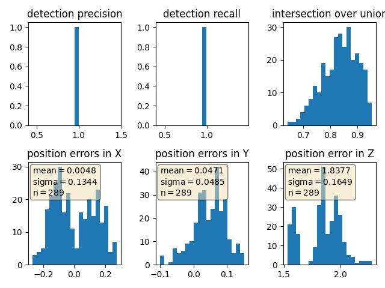


When I experimented with the z cooridante as shown below, I had the result shown below for 
the z position error mean:

z = z_bv

````
ll_frame_positives=306, all_frame_true_positives=289, all_frame_false_negatives=17, all_frame_false_positives=15
precision = 0.9506578947368421, recall = 0.9444444444444444
````


The outcome of the preciosn recall when configs_det.use_labels_as_objects = True is shown below:

````
all_frame_positives=306, all_frame_true_positives=306, all_frame_false_negatives=0, all_frame_false_positives=0
precision = 1.0, recall = 1.0
````

